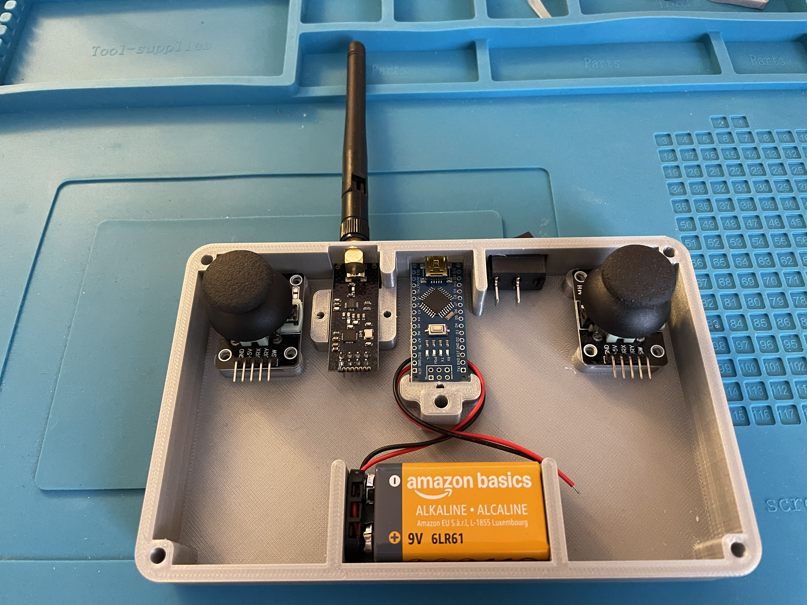
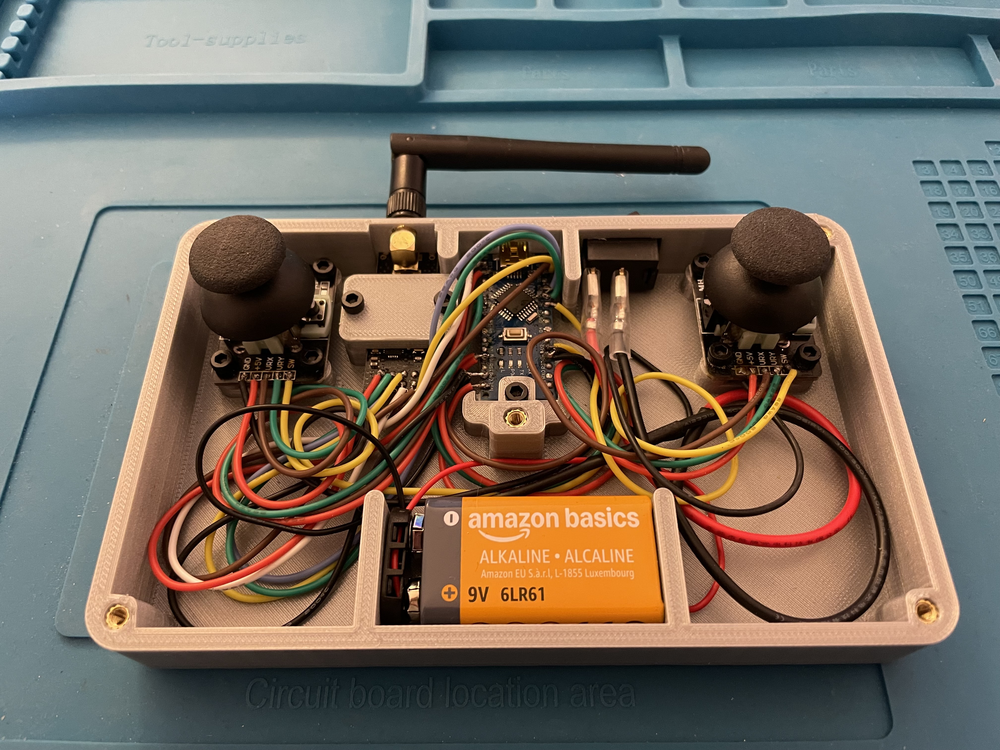
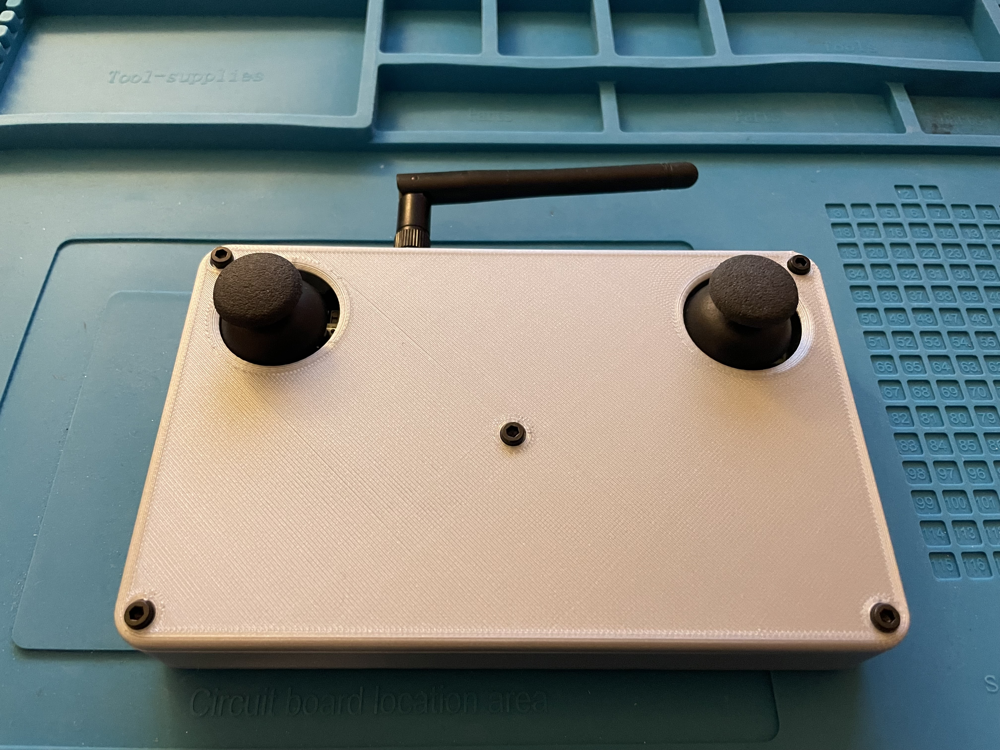

# Arduino-based nRF24L01 Transmitter

## 🎮 Demo

## 🔧 Electronic Components
- **Arduino Nano**
- **nRF24L01 module** (long-range antenna version)
- **2× Joysticks**
- **On/Off switch**
- **Battery + connector**

<!-- **Schematic:**  
 -->

## 🧩 3D Printed Case
The case is adapted from:
- YouTube overview:  
  https://www.youtube.com/watch?v=I6TKGMbHcfo  
- Original model files:  
  https://www.thingiverse.com/thing:4554557

I modified the model to fit my components and overall layout.

## 💻 Software
This entire project was programmed in **pure C** to learn low-level concepts such as:

- direct register access  
- SPI communication  
- UART debugging  
- nRF24L01 configuration & packet transmission  

The goal was to build a minimal but fully functional transmitter system without using Arduino libraries.

## 📸 Results

| Components | Processing | Final |
|-----------|------------|-------|
|  |  |  |
